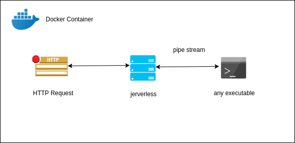

<div align="center">
   
</div>
<br/>

[](https://github.com/jerverless/jerverless/blob/master/LICENSE) 
 [](https://travis-ci.com/jerverless/jerverless)
 [](https://github.com/jerverless/jerverless/releases)
  [](https://github.com/jerverless/jerverless/commits/master)
[](http://hits.dwyl.io/jerverless/jerverless)
[](https://opencollective.com/jerverless) 

Turn anything into a serverless function.. Docker ready!

jerverless is a serverless runner which will execute anything (binaries, commands or your scripts) as a serverless function. It simply pipes http POST data into STDIN of any executable vice versa.

## How it works!

<div  align="center">
  
</div>


See more info,

- [A friendly introduction to Serverless Architecture and Why we built jerverless?](https://medium.com/@shalithasuranga/a-friendly-introduction-to-serverless-architecture-and-why-we-built-jerverless-runtime-4c09e7d81e56)


## Example functions

- [Bash](https://github.com/jerverless/jerverless/tree/master/examples/bash)
- [Python](https://github.com/jerverless/jerverless/tree/master/examples/python)
- [Java](https://github.com/jerverless/jerverless/tree/master/examples/java)
- [Ballerina](https://github.com/jerverless/jerverless/tree/master/examples/ballerina)
- [C](https://github.com/jerverless/jerverless/tree/master/examples/c)
- [C++](https://github.com/jerverless/jerverless/tree/master/examples/cpp)
- [Node](https://github.com/jerverless/jerverless/tree/master/examples/node)
- [Go](https://github.com/jerverless/jerverless/tree/master/examples/golang)
- [Ruby](https://github.com/jerverless/jerverless/tree/master/examples/ruby)
- [Rust](https://github.com/jerverless/jerverless/tree/master/examples/rust)
- [php](https://github.com/jerverless/jerverless/tree/master/examples/php)
- [powershell](https://github.com/jerverless/jerverless/tree/master/examples/powershell)

## How to create functions?

### On Machine (or VM)

1. Download **Jerverless** and extract the archive

2. Create `jerverless.yml`
```yaml
# use port 8080
port: 8080
# enable CORS for the server
cors: '*'
# Define your routes
routes:
  # a sample route with
  - endpoint: /foo # endpoint /foo
    command: python test.py # command to run
    contentType: text/html # set content type
    
  - endpoint: /bar #endpoint /bar
    command: python test.py --bar # command with an argument
    contentType: text/html # set your content type
    cors: 'xyz.com' # override cors for this specific route
```
3. Create your program (eg:- `helloworld.py`)
>We are using python2.7 in example
```python
name = raw_input()
print "Hello %s!" % name
```
4. Start server!

```
 $ bin/jerverless
```

or if you are on windows

```
 $ bin\jerverless.bat
```

5. Test it!

```
 $ curl -d Jerverless http://localhost:8080/foo
```

Or simply use [template](https://github.com/jerverless/jerverless/tree/master/examples) and jump to last step! 

### Docker

1. On your local machine, clone this repo and go to an examples directory of choice (eg: python): 

```
 $ git clone https://github.com/jerverless/jerverless.git
 $ cd jerverless/examples/python
```

2. Create the docker image:

```
 $ docker build --no-cache -t jerverless-py .
```

3. Run the app:

```
 $ docker run -it -p 8080:8080 jerverless-py
```

4. Navigate to 'https://localhost:8080/function' in your browser.

### Kubernetes

1. Create docker image for your function and push to dockerhub

2. Add docker image name to `.yml` deployment


## Project Status

- [x] Initial work (Structure, basic server with runner)
- [x] Multithreaded server mode
- [ ] Unit cases
- [x] CLI commands
- [x] Basic Samples
- [x] Docs
- [x] Beta Release!


# Developer Guide

## Requirements
- JDK 1.8

## Getting started

Clone the repository in your local directory

```bash
 $ git clone <forked_url>
```

We are using gradle as the build tool.
This command will download and install gradle, then it will build the jar file.

> Windows users may use **.\gradlew** _instead_ of **./gradlew**
> It applies to all bash commands listed below.

```bash
 $ ./gradlew assemble
```

The resulted jar file can be found in `build/libs`

```
 $ java -jar build/libs/jerverless-1.0.0.jar
```

Or run 

```bash
 $ ./gradlew assembleDist
```

This will create distributions of `jerverless`, you can find them in `build/distributions/`

To install this distribution in a path you desired try out

```bash
 $ ./gradlew installDist
```

By default it will be installed in `build/install/jerverless`

To run the distribution, try

```bash
 $ build/install/jerverless/bin/jerverless
```

## Become a committer 

Submit a pull request or raise 3 helpful issues to join jerverless Team!

